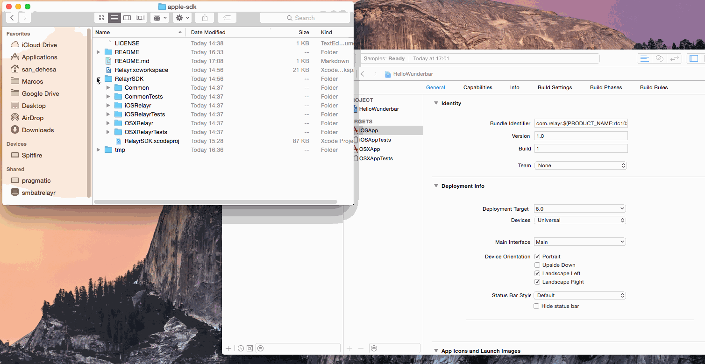

# Introduction

Welcome to the relayr iOS&OSX SDK (*Beta*).

The information in this section will assist you in building your first iOS/OSX relayr app,
referencing our [GitHub Apple repository](https://github.com/relayr/apple-sdk).  

The Relayr SDK requires:

* For iOS applications: Xcode 6+ and iOS 8+ (since the framework is released in the *Cocoa Touch Framework* form).
* For OSX applications: Xcode 5+ and OSX 10.9+.

The *RelayrSDK* project generates a product called `Relayr.framework` which, depending on your use purpose, can be run on a mac or on an iOS device.

Getting Started
---------------

### Obtaining the Framework

The framework can be obtained in the following manner:
Generate the binary `.framework` file from this Xcode project. Just select the platform you want from the project's targets and click *build* (⌘+B).

  

### Using the Framework

The framework can be used in two different manners:

#### 1. Dragging and Dropping the Framework

Drag & Drop the `.framework` file onto your project and make sure that the framework appears both in *Embedded Binaries* and in *Linked Frameworks and Libraries*; 

  

#### 2. Using the Framework as a Sub-Project:

* Drag & Drop the `Relayr.xcodeproj` onto your project and add the *Relayr* project product as *Embedded Binaries* (and therefore also *Linked Frameworks and Libraries*).

  

