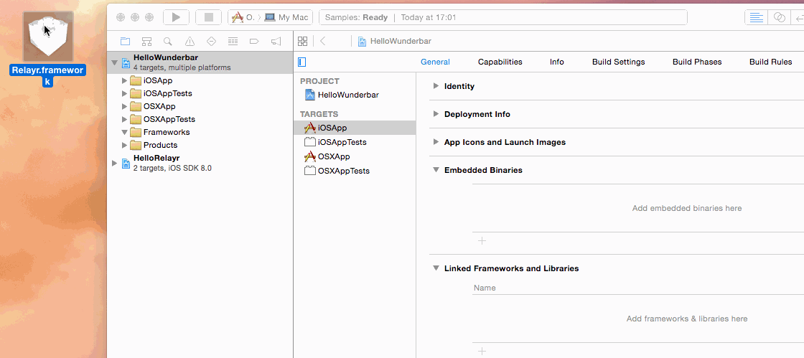

Getting Started
---------------

Below are a few basic steps to help get you started, building your first relayr iOS/OSX application. 

### Prerequisites

The relayr SDK requires: 

* For iOS applications: Xcode 6+ and iOS 8+ (since the framework is released in the *Cocoa Touch Framework* form).
* For OSX applications: Xcode 5+ and OSX 10.9+.

The *RelayrSDK* project generates a product called `Relayr.framework` which, depending on your use purpose, can be run on a mac or on an iOS device.

### Obtaining the Framework

You can obtain the framework in one of the following manners:

A. **Download** the `.framework` file for the platform you are developing for from the latest [Github release page](https://github.com/relayr/apple-sdk/releases/tag/v0.2.1).

*or* 

B. **Generate** the `.framework` file from the source code.

  To generate the framework follow the steps below:

  1. Download the repository from [GitHub](https://github.com/relayr/apple-sdk)
  2. Open the `Relayr.workspace` in Xcode.
  3. Select a specific target from the workspace's targets. If you are developing for iOS, select `Relayr_iOS`; if you are developing for the Mac, select `Relayr_OSX`.
  4. Select the platform for your target. For Mac, there is only one choice (Mac); but for iOS, you can generate a framework for the simulator or for an iOS physical device.
  5. Edit the schema to select the type of build you want: Debug, Release, Distribution.
  6. Select `Product > Build` from the Xcode top menu (or press ⌘+B).
  7. Grab your `.framework` file from the created `/bin` folder on the workspace directory.

*or*

C. **Make** the `RelayrSDK` project a dependency of your build chain.

  This manner allows for maximum customization, however, you do need to know your way around XCode to use it. The Relayr SDK will build its product in a separate folder. Therefore, you need not only to add the framework as a target dependency, but also change your build settings to search for the framework on the `Build Settings` tab of your project.

### Using the Framework

To use the framework, just drag and drop the `.framework` file onto your project and make sure that the framework appears both under *Embedded Binaries* and under *Linked Frameworks and Libraries*;

  

The default action when dragging and dropping a framework onto a project is a simple *linking* of the framework, rather than *adding* it to the final binary image. In this case, you will need to remove the framework from *Linked Frameworks and Libraries* and add it to the *Embedded Binaries* (which will automatically link the framework as well).

