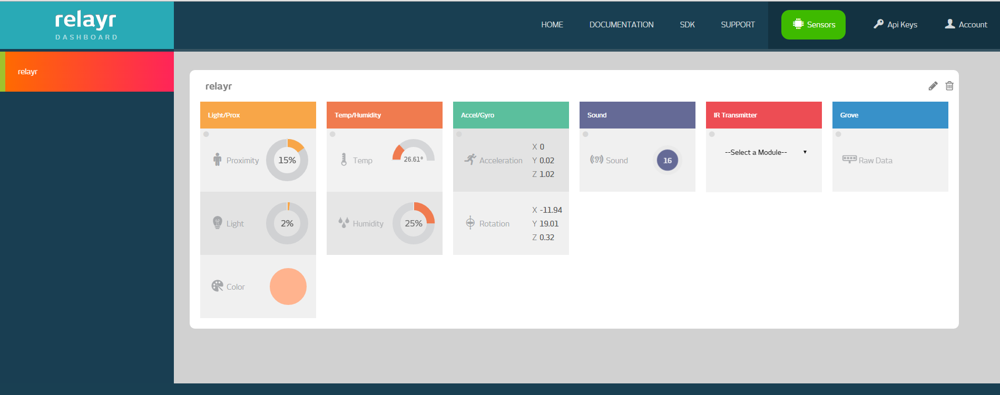
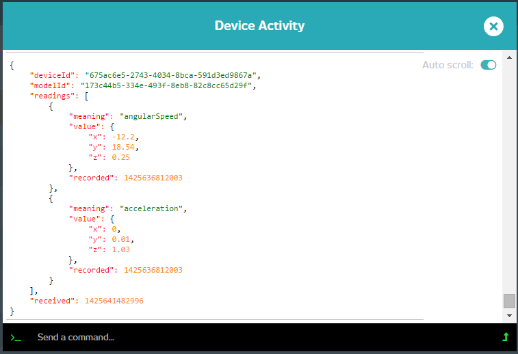
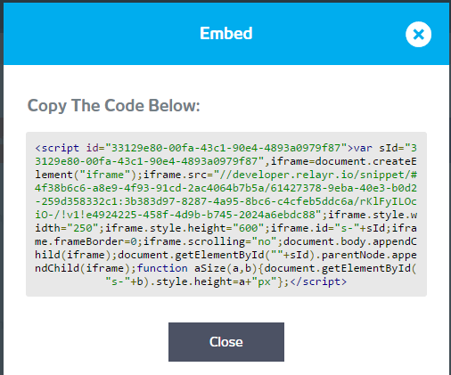
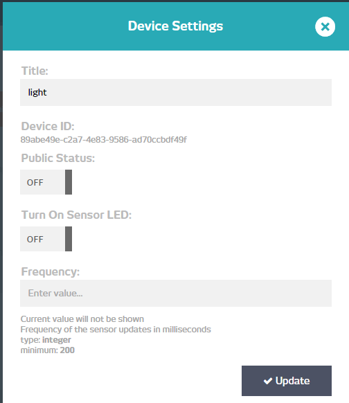
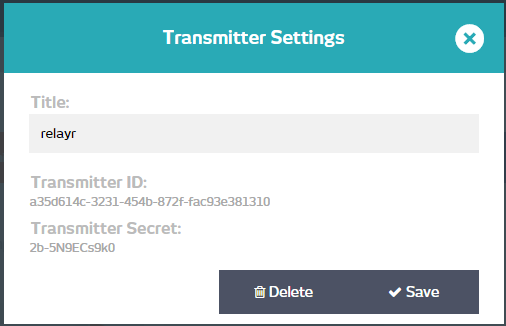

# Understanding the Devices Page

We've added some new and exciting features to our device page and we'd like to make sure that you know all about them. Are you ready to get down to the nitty gritty of your Devices' page? well then, let's get started!

## Device Data

The main purpose of the Devices page is to allow you to see the data coming from the 4 sensors which collect data. The [Onboarding process](https://developer.relayr.io/documents/Welcome/OnBoarding) is where you introduce your WunderBar to the relayr platform and associate it with your relayr user. 

**A note regarding the infrared transmitter:** since this is a transmitter and not a sensor, it will not display and data. It does include a hard coded version of the commands it is able to send to the LED strip. Please note that since the IR protocol is hardcoded into it, these commands will only work for the specific LED strip using the protocol. 

Once you've onboarded, you can test the different sensors and see the bars, dials and meters move around as the values come through. These are pretty self explanatory so we won't spend too much time talking about them and move straight to Device Options 

## Device Options

Once you hover over the device console, the options Activity Log, Embed and Settings (in this order from left to right) are shown on its header:

### The Activity Log 

The activity log displays the data as it arrives from the relayr cloud platform. It is delivered in the following form:

	{
	    "deviceId": "675ac6e5-2743-4034-8bca-591d3ed9867a",
	    "modelId": "173c44b5-334e-493f-8eb8-82c8cc65d29f",
	    "readings": [
	        {
	            "meaning": "angularSpeed",
	            "value": {
	                "x": -12.08,
	                "y": 18.41,
	                "z": 0.64
	            },
	            "recorded": 1425636812003
	        },
	        {
	            "meaning": "acceleration",
	            "value": {
	                "x": -0.01,
	                "y": 0.01,
	                "z": 1.03
	            },
	            "recorded": 1425636812003
	        }
	    ],
	    "received": 1425640911045
	}
	
Each response contains the `deviceId`, `modelId` and the `readings`. In our example above the device is actually made up of two sensors - humidity and temperature, so the readings parameter is essentially an array containing two items. Each item is identified by a `meaning` parameter and contains an array of values.
in addition to the readings, a timestamp indicating when the reading was recorded is sent, as well as one indicating when it was received by the relayr cloud.

### Sending a Command to a Device

The bottom section of the Activity Log allows you to send the device a command. The two commands which are currently implemented are **turning the device's LED** on and **sending the Bridge Module a command** to be passed on to an external device, in case one is connected.

#### Turning the Sensor LED On

In order to use the commands interface to turn a sensor's LED on, simply enter the following: 

	{"path":"led", "command":"cmd","value":1} 

and you should see the LED of the respective sensor turn on for a period of 30 seconds.	

#### Sending a Command to the Bridge Module

In order to use the commands interface to send a command to the bridge module to pass on to an externally connected device, simply enter the following: 

	{"path":"", "command":"down_ch_payload","value":[DOWN_CH_PAYLOAD]} 

The payload should be between 1 and 20 bytes long.

### The Embed Option

The embed option allows you to place a representation of your sensor anywhere outside the Devices page you would like. Simply click the embed option, copy the script and place it in the location of your choice.

### Settings

Clicking the Settings icon will pop up a window containing the following information about the respective device

You can find the deviceId for usage in your code, you are able to make your device public, thus accessible to other users and you could also change the frequency of sampling, i.e. the rate of data delivery from the device to the cloud. Please note that the current frequency value will not be shown, it will be updated though.

## WunderBar Options

Your WunderBar options, also known as Transmitter options, could be found by hovering over the name of the WunderBar onboarde on the left hand side menu.

 

You are able to delete a WunderBar as well as change view its settings

You can rename it, view its Id and its secret, which is essentially its "user" on the relayr cloud.

These options are also available via the icons on the right hand side on the main page.

So! Now you know everything there is to know about our devices page. Give it a try. We're sure you'll love it!

