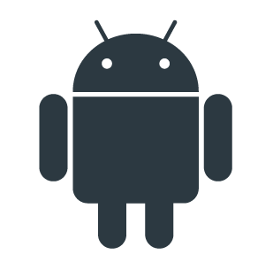
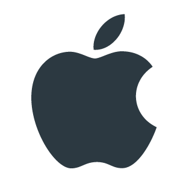

# Welcome to the relayr Documentation Center 

### relayr is all about bringing things to life, it's about allowing app developers access to the physical world around them.

### We've made it as easy as possible for you to start integrating your awesome apps with the relayr platform. Here are a few tips to get you started:

##### You may want to start by having a look at our Authorization Protocol which provides a general overview of OAuth as well as an explanation how the protocol has been implemented on the relayr platform.

##### If you are an Android developer, be sure to get inspired by our Android SDK which provides all the tools you need in order to integrate your Android projects with our platform. All available Endpoints and code samples just waiting to be implemented.

##### If your passion is iOS - don't worry, we have not forgotten you. You are more than welcome to check out our iOS Framework for available Endpoints, code samples and all you need to integrate your iOS project with the relayr platform.

#####  Our Registration API includes a detailed list of all endpoints and use cases of the relayr Registration API. 
 
#####  We've also included information about how we've integrated with our data distribution service - PubNub. To read all about it, have a look at our PubNub Introduction

##### And most importantly, have fun while you're at it!

