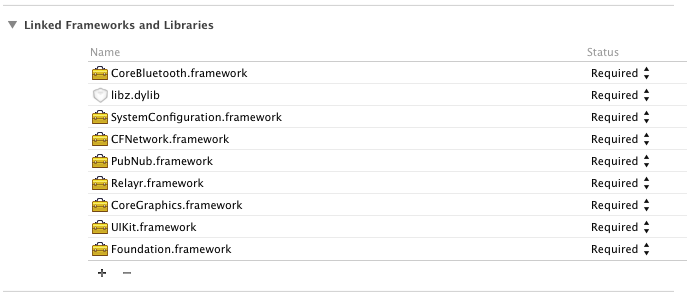

# The relayr iOS Framework 

The relayr iOS SDK provides iOS app developers with a number of programmatic access points into the relayr API.

## Setup

* Download the Relayr.framework from [https://github.com/relayr/ios-sdk/releases](https://github.com/relayr/ios-sdk/releases)
* Create a new project in XCode
* Drag and drop the following frameworks/libraries into XCode:
	
	* Relayr.framework
	* libz.dylib
	* PubNub.framework
	* SystemConfiguration.framework
	* CFNetwork.framework
	* CoreBluetooth.framework
	* CoreGraphics.framework
	* UIKit.framework
	* Foundation.framework

#### Alternatively:

* Place an import statemtent in the Prefix.pch file
* Create a new project in XCode

#### This is an example of a Prefix.pch containing the statement:

	
			
			#import <Availability.h>
		
			#ifndef __IPHONE_5_0
			#warning "This project uses features only available in iOS SDK 5.0 and later."
			#endif
			
			#ifdef __OBJC__
			  #import <UIKit/UIKit.h>
			  #import <Foundation/Foundation.h>
			  #import <Relayr/Relayr.h>
			#endif
	
## Basic Endpoints

API methods: [https://github.com/relayr/ios-sdk/tree/development](https://github.com/relayr/ios-sdk/tree/development)

The two main classes facilitated by the iOS framework are the _RLARemoteUser_ and the _RLALocalUser_.

**_RLARemoteUser_** refers to a user connecting their app to a device, via the relayr platform.

**_RLALocalUser_**  refers to a user connecting their app to a device directly, without the mediation of the relayr platform. When this scenario is utilized, all BLE communication with the device is handled by the framework, making it transparent to the app developer. 

The main difference between the two classes is the Authentication Endpoint. For the remote user scenario, authentication is necessary. For the direct connection, i.e. the local user scenario, authentication is not required. In the latter scenario, the user object is retrieved without authentication.

The other endpoints are identical, for both classes.

### 1. User Authentication

#### Class: RLALocalUser

In this scenario the user object is fetched rather than being authenticated.

**Example**

		self.RLA_user = [RLALocalUser user];

#### Class: RLARemoteUser

In this scenario, authentication is required.
The variables required for this method are the `appID` and `secret`. These are attributed to the application during its registration on the relayr platform.

**Example**

		  // Start relayr authentication
		  NSString *appID = @"rWd8mwESapYzR2UOZAvXm7jFMp38L_BY";
		  NSString *secret = @"IJHUNvQ4fzSY3syVBZAbI57.rCYaRdIV";
		  __block typeof(self) weakSelf = self;
		  [RLARemoteUser
		   authenticateLocalUserWithAppID:appID
		   appSecret:secret
		   presentingViewController:self
		   completionHandler:^(RLARemoteUser *user, NSError *error) {
		     
		     // User authenticated
		     if (user) {
		       typeof(weakSelf) strongSelf = weakSelf;
		       [strongSelf RLA_presentMenuViewControllerWithUser:user];
		     }
		     
		     // Authentication failed
		     if (error) {
		       
		       // Present error
		       NSString *message = [error localizedDescription];
		       if (!message) message = @"Unknown error";
		       [[[UIAlertView alloc] initWithTitle:@"Authentication error"
		                                   message:message
		                                  delegate:nil
		                         cancelButtonTitle:@"OK"
		                         otherButtonTitles:nil] show];
		     }   }];
   
   

### 2. Registered Devices

Returns an array of the devices registered under a user. 

**Example**

		// Fetch devices
	    [self.RLA_user devicesWithCompletionHandler:^(NSArray *devices, NSError *error) {
	    
	    	// Data Manipulation
	    }];

### 3. Device Readings

Subscribes the app to a specific device (sensor) channel as to enable it to receive data from it. This endpoint should be preceded by two initial methods:

1. Device Selection - Select device out of the registered devices.
2. Sensor Selection - As a device may include multiple sensors, one should be selected for data collection.

**Example**
		
		// Fetch devices
	    [self.RLA_user devicesWithCompletionHandler:^(NSArray *devices, NSError *error) {
	    
	    	// Cancel on error
	    	if (error) return;
	    
	    	// Devices found: Start data collection
			RLADevice *device = [devices lastObject];
		    [device startMonitoringWithSuccessHandler:^(NSError *error) {
	
				// Data Manipulation
				// ....
		    }];
	    }];

### 4. View Sensor Data

Displays the readings sent by the device. This endpoint is preceded by the folowing methods:

1. Device Selection - Select device out of the registered devices.
2. Sensor Selection - As a device may include multiple sensors, one should be selected for data collection.
3. Initiate Data Collection - Subscribing the app to the specific device (sensor) channel.

**Example**
	
		// Fetch devices
	    [self.RLA_user devicesWithCompletionHandler:^(NSArray *devices, NSError *error) {
	    
	    	// Cancel on error
	    	if (error) return;
	    
	    	// Devices found: Start data collection
			RLADevice *device = [devices lastObject];
		    [device startMonitoringWithSuccessHandler:^(NSError *error) {
				
				// In this example a temperature sensor is assumed
				// Get the temperature readings
				NSArray *sensors = [device sensors];
				RLATemperatureSensor *sensor = [sensors lastObject];
				RLATemperatureSensorValue  *value = [sensor value];
				NSNumber *temperature = [value temperature];
		    }];
	    }];

